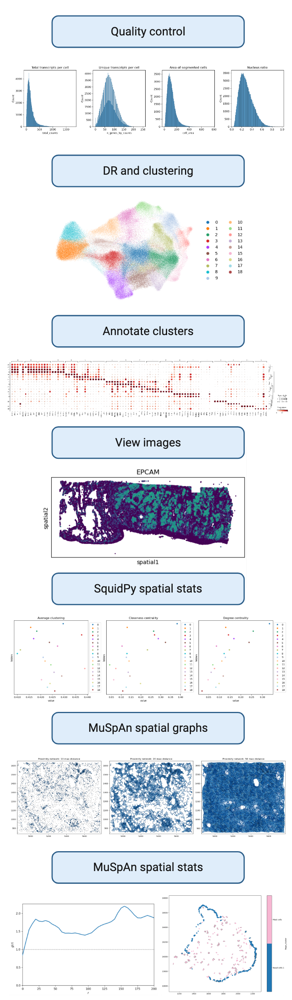

# Reproducible Spatial Transcriptomics Pipeline with RSE Best Practices

<!-- A brief description of your exemplar, which may include an image -->
This exemplar details an analysis pipeline for spatial transcriptomics (10X Xenium platform). Below is representative image of spatial transcriptomics data.


The pipeline covers preprocessing, quality control, dimensionality reduction, clustering, annotation, viewing spatial images, and spatial statistics (squidpy and MuSpAn).

Cell segmentation is *not* included in this pipeline as it is performed prior to the analysis using the 10X Genomics Xenium software. If you would like to segment the cells yourself, please refer to the [10X Genomics Nucleus and Cell Segmentation Algorithms](https://www.10xgenomics.com/support/software/xenium-onboard-analysis/latest/algorithms-overview/segmentation) for more information.



In addition to the analysis pipeline, we highlight several good software engineering practices including version control, containarization, linting, and continuous integration. Details on these practices and how to implement them can be found in the [Best Practices for Software Engineering](docs/RSE_best_practices.md) section of the documentation.

<!-- Author information -->
This exemplar was developed at Imperial College London by *Sara Patti* in
collaboration with *Adrian D'Alessandro* from Research Software Engineering and
*Jesus Urtasun* from Research Computing & Data Science at the Early Career
Researcher Institute.

<!-- Learning Outcomes.
Aim for 3 - 4 points that illustrate what knowledge and
skills will be gained by studying your ReCoDE exemplar. -->
## Learning Outcomes 🎓

<!-- TODO: NEED TO BE REVISED -->

After completing this exemplar, students will be able to:

- Describe the key steps in spatial transcriptomic analysis
- Analyze spatial transcriptomic data and apply spatial statistical methods
- Design and build a reproducible analysis pipeline
- Apply research software engineering (RSE) best practices, including testing and continuous integration

<!-- Audience. Think broadly as to who will benefit. -->
## Target Audience 🎯

1) Biologists interested in analyzing spatial transcriptomics data
2) Biologists interested in developing bioinformatic pipelines
3) RSE interested in analyzing spatial transcriptomics data

<!-- Requirements. -->
## Prerequisites ✅

Prior to undertaking this exemplar, learners should have the following skills and knowledge:

- Python

Although not necessary, we recommend the following skills and knowledge to enhance the learning experience:

- Familiarity with the scverse ecosystem (e.g. scanpy, squidpy)
- Familiarity with data analysis and statistics (including spatial statistics)
- Familiarity with spatial transcriptomics

### Academic 📚

- Basic understanding of Python programming and command line interface (CLI)
- Familiarity with [scverse ecosystem](https://scverse.org/) (e.g. scanpy, squidpy)
- Familiarity with data analysis and statistics (including spatial statistics)
- Familiarity with spatial transcriptomics platforms (e.g. 10X Genomics Xenium)

### System 💻
<!-- TODO: NEED TO BE REVISED -->
- Python 3.12+
- Anaconda required for Mac Intel users, for more details please refer to the [Installation Guide](docs/installation.md)

<!-- Quick Start Guide. Tell learners how to engage with the exemplar. -->
## Getting Started 🚀

1. Start by cloning the repository to your local machine in the directory of your choice

   ```bash
   git clone https://github.com/ImperialCollegeLondon/ReCoDe-spatial-transcriptomics.git
   ```

2. Download the [Xenium Lung FFPE data](https://www.10xgenomics.com/datasets/ffpe-human-lung-cancer-data-with-human-immuno-oncology-profiling-panel-and-custom-add-on-1-standard)
   - Data can be downloaded from the 10x Genomics website, or directly from the command line.
      - If downloading from the website, download the `Xenium_V1_Human_Lung_Cancer_Addon_FFPE_outs.zip` file.
      - If downloading from the command line, use the following command:

        ```bash
        curl -O https://cf.10xgenomics.com/samples/xenium/2.0.0/Xenium_V1_Human_Lung_Cancer_Addon_FFPE/Xenium_V1_Human_Lung_Cancer_Addon_FFPE_outs.zip
        ```

   - Unzip the downloaded file.
     - If you downloaded the file from the website, unzip it using your preferred method.
     - If you downloaded the file from the command line, use the following command:

        ```bash
        unzip Xenium_V1_Human_Lung_Cancer_Addon_FFPE_outs.zip
        ```

3. Create new virtual environment using `conda` or `venv`
Full details on how to set up the environment and install necessary packages can be found in the [Installation Guide](docs/installation.md).

If you are using `venv`, run the following command:

   ```bash
   python -m venv recode_st
   source recode_st/bin/activate  # On Windows use: st_env\Scripts\activate
   pip install git+https://github.com/ImperialCollegeLondon/ReCoDe-spatial-transcriptomics.git
   ```

If you are using `conda`, run the following command:

   ```bash
   cd ReCoDe-spatial-transcriptomics # Ensure you are in the root directory
   of the repo
   conda env create -f environment.yml
   conda activate recode_st
   pip install --no-build-isolation --no-deps -e .
   pip install https://docs.muspan.co.uk/code/latest.zip # If you need the MuSpAn modules
   ```

Newest versions for some packages do not support older Macs with Intel CPUs, so we recommend using the `conda` environment for these systems. If you are using an Apple Silicon Mac, you can use either `conda` or `venv`.
4. Update the `config.yaml` file with the relevant paths and parameters for your analysis. This file contains configuration settings for the analysis pipeline, such as paths to data files and parameters for various steps in the pipeline.
5. Run the analysis pipeline by executing the main script or following the workflow outlined in the documentation.

<!-- Software. What languages, libraries, software you use. -->
## Software Tools 🛠️

- Python
- squidpy
- MuSpAn

<!-- Repository structure. Explain how your code is structured. -->
## Project Structure 🗂️

<!-- TODO: NEED TO BE REVISED -->

Overview of code organisation and structure.

```text
.
├── notebooks
│ ├── ex1.ipynb
├── src
│ ├── file1.py
│ ├── file2.cpp
│ ├── ...
│ └── data
├── docs
└── test
```

Code is organised into logical components:

- `notebooks` for tutorials and exercises
- `src` for core code,
- `data` contains needed datasets
<!-- TODO: NEED TO BE REVISED:  should I upload a zip file? -->
- `docs` for documentation
- `test` for testing scripts

## Roadmap 🗺️

### Preprocessing & Quality Control

<!-- TODO: NEED TO BE REVISED -->

Goal: Ensure clean, usable spatial gene expression data.

It is critical to preprocess and perform quality control on the data before proceeding with analysis. This step ensures that the data is clean, usable, and of high quality by removing low quality cells and low quality transcripts.

Steps:

- Calculate quality metrics
- Filter low-quality genes and cells
- Normalize and transform gene counts

### Dimensionality Reduction & Clustering

Goal: Identify patterns and groups of similar gene expression profiles.

Dimensionality Reduction a technique used to reduce the number of features (or dimensions) in a dataset while preserving important information. Clustering is a technique used to group similar data points together based on their features. It is critical to determine the most accurate number of clusters to ensure that the clusters are meaningful and representative of the data.

Steps:

- Compute PCA and neighbors
- Compute and plot UMAP
- Cluster cells using Leiden algorithms
- Visualize clusters on UMAP

### Annotation & Cell Type Identification

Goal: Assign biological meaning to clusters.

Annotation is the process of assigning biological meaning to clusters. This typically equates to assigning a cell type identification to each clusters. is the process of identifying the cell types present in the data. Choosing the number of clusters can be challenging and can be seen as more of an art than a science. It is important to choose the number of clusters that best represents the data and the biological question being asked. More information on how to choose the number of clusters can be found in the [scRNAseq best practices](https://www.sc-best-practices.org/cellular_structure/clustering.html).

Steps:

- Compute differentially expressed genes for each cluster
- Visualize cluster marker genes
- Identify cell types with marker genes
- Annotate clusters with known cell types

### Spatial Mapping & Visualization

Goal: Map gene expression and clusters back to their spatial context.

- Overlay expression and clusters on tissue image
- Plot spatially enriched genes
- Map cell types or states in space

### Spatial Statistics & Spatially Variable Genes

Goal: Quantify spatial patterns and variability utilizing spatial statistics.

We use two different approaches to spatial statistics: Squidpy and MuSpAn.

- Compute spatial autocorrelation (e.g. Moran's I)

### TODO: Differential Expression & Functional Analysis

Goal: Discover meaningful biology.

- Spatially variable genes (SVGs)
- DE between regions or conditions
- Pathway or GO enrichment

<!-- Data availability (remove this section if no data used) -->
## Data 📊

<!-- TODO: NEED TO BE REVISED -->

- Small toy dataset for testing and development (TBD)
- [Xenium Lung FFPE data](https://www.10xgenomics.com/datasets/ffpe-human-lung-cancer-data-with-human-immuno-oncology-profiling-panel-and-custom-add-on-1-standard)

<!-- Best practice notes. -->
## Best Practice Notes 📝

<!-- TODO: NEED TO BE REVISED -->

- Git version control
- Virtual environments (e.g. conda, venv)
- Code modularity (e.g. functions, classes)
- Code documentation (e.g. docstrings, comments)
- Code style (e.g. PEP 8 for Python)
- Code testing
- Use of continuous integration (pre-commit, ruff) (?)

<!-- Estimate the time it will take for a learner to progress through the exemplar. -->
## Estimated Time ⏳

<!-- TODO: NEED TO BE REVISED -->

| Task       | Time    |
| ---------- | ------- |
| Reading    | 3 hours |
| Practising | 3 hours |

<!-- Any references, or other resources. -->
## Additional Resources 🔗

### Learn more about spatial transcriptomics

- [An introduction to spatial transcriptomics for biomedical research](https://genomemedicine.biomedcentral.com/articles/10.1186/s13073-022-01075-1)
- [10x Genomics Xenium documentation](https://www.10xgenomics.com/xenium)
- [Single Cell Spatial Transcriptomics: 10x Genomics Xenium](https://www.youtube.com/watch?v=R4ppUVWjm7s)
- [Best practices for single cell  and spatial transcriptomics](https://www.sc-best-practices.org/preamble.html)

### Learn more about networks and spatial statistics

- [Network Science](https://networksciencebook.com/)
- [Graph Representation](https://www.youtube.com/watch?v=k1wraWzqtvQ)
- [Theory of Spatial statistics](https://www.paulamoraga.com/book-spatial/index.html)

### Learn more about our tools and libraries

- [30-days-of-python](https://github.com/Asabeneh/30-Days-Of-Python/tree/master)
- [scverse documentation](https://scverse.org/)
- [squidpy documentation](https://squidpy.readthedocs.io/en/stable/)
- [scanpy documentation](https://scanpy.readthedocs.io/en/stable/)
- [MuSpAn documentation](https://www.muspan.co.uk/resources)

### Video Tutorials

We have included bioinformatic bloggers that can help you get started with understanding key concepts in bioinformatics and transcriptomics analysis:

- [Sanbomics](https://www.youtube.com/@sanbomics)
- [Biostatsquid](https://www.youtube.com/@biostatsquid)
- [Bioinformagician](https://www.youtube.com/@Bioinformagician)

<!-- LICENCE.
Imperial prefers BSD-3. Please update the LICENSE.md file with the current year.
-->
## Licence 📄

This project is licensed under the [BSD-3-Clause license](https://github.com/ImperialCollegeLondon/ReCoDe-spatial-transcriptomics/blob/main/LICENSE.md).
