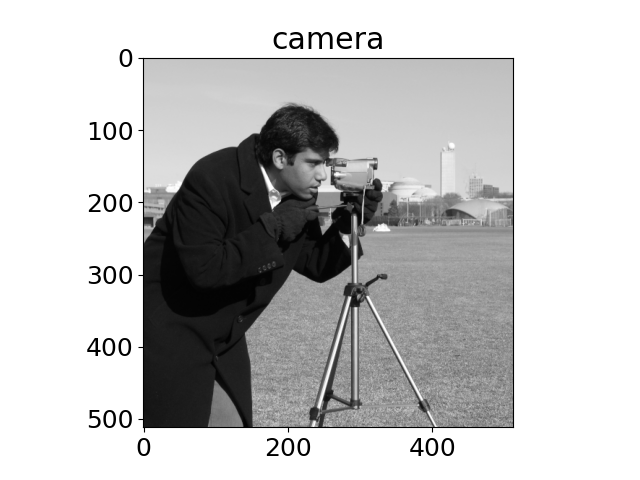

<!--
This README template is designed with dual purpose.

It should help you think about and plan various aspects of your
exemplar. In this regard, the document need not be completed in
a single pass. Some sections will be relatively straightforward
to complete, others may evolve over time.

Once complete, this README will serve as the landing page for
your exemplar, providing learners with an outline of what they
can expect should they engage with the work.

Recall that you are developing a software project and learning
resource at the same time. It is important to keep this in mind
throughout the development and plan accordingly.
-->


<!-- Your exemplar title. Make it sound catchy! -->
# This is my exemplar title

<!-- A brief description of your exemplar, which may include an image -->
This is a brief abstract of my exemplar, which includes a representative image.


<!-- Author information -->
This exemplar was developed at Imperial College London by (YOUR NAME) in
collaboration with (RSE MENTOR) from Research Software Engineering and
(RCDS MENTOR) from Research Computing & Data Science at the Early Career
Researcher Institute.


<!-- Learning Outcomes. 
Aim for 3 - 4 points that illustrate what knowledge and
skills will be gained by studying your ReCoDE exemplar. -->
## Learning Outcomes 🎓

After completing this exemplar, students will:

- Learning Outcome 1
- Learning Outcome 2
- Learning Outcome 3


<!-- Audience. Think broadly as to who will benefit. -->
## Target Audience 🎯

Who will benefit from studying this exemplar.


<!-- Requirements.
What skills and knowledge will students need before starting?
e.g. ECRI courses, knowledge of a programming language or library...

Is it a prerequisite skill or learning outcome?
e.g. If your project uses a niche library, you could either set it as a
requirement or make it a learning outcome above. If a learning outcome,
you must include a relevant section that helps with learning this library.
-->
## Prerequisites ✅

### Academic 📚

- Required skills/knowledge (e.g. programming languages, libraries, theory, courses)

### System 💻

- System requirements (e.g. Python 3.11+, Anaconda, 50 GB disk space, etc.)
- Hardware or HPC requirements (if any)


<!-- Quick Start Guide. Tell learners how to engage with the exemplar. -->
## Getting Started 🚀

e.g. Step-by-step guide:

1. Start by (instruction).
2. Visit the sections of this notebook in some particular order.
3. Attempt exercises `1a`, `1b`, etc.
4. Progress to advanced materials in the Github repository linked here.
5. Compare with solutions available in the `solutions` folder.


<!-- Background. Tell learners about why this exemplar is useful. -->
## Disciplinary Background 🔬
     
Briefly describe how this project fits in your discipline, why you chose
to work on it, and what other disciplines may find it useful.


<!-- Software. What languages, libraries, software you use. -->
## Software Tools 🛠️

Programming language(s), libraries, and scientific software used.


<!-- Repository structure. Explain how your code is structured. -->
## Project Structure 🗂️

Overview of code organisation and structure.

```
.
├── notebooks
│ ├── ex1.ipynb
├── src
│ ├── file1.py
│ ├── file2.cpp
│ ├── ...
│ └── data
├── docs
└── test
```

Code is organised into logical components:

- `notebooks` for tutorials and exercises
- `src` for core code, potentially divided into further modules
- `data` within `src` for datasets
- `docs` for documentation
- `test` for testing scripts


<!-- Roadmap.
Identify the project core (a minimal working example). This
is what you should develop first, ideally by week 6. Defining
a core helps ensure that, despite a tight timeline, we will end
up with a complete project.

Identify project extensions. These are additional features that
you will implement after the core of the project is finished; you
could also propose extensions as open-ended exercises for the ReCoDE
audience.

Outline the process of creating the exemplar as a project roadmap
with individual steps. This will help you with defining the scope of 
the project. When you think about this, imagine that you are explaining
it to a new PhD student. Assume that this student is from a related (but
not necessarily same) discipline. They can code but have never undertaken
a larger project. The steps should follow logical development of the
project and good practice. Each will be relatively independent and contain
its own learning annotation and links to other learning materials if
appropriate. The learning annotation is going to form a significant portion
of your efforts.

Learning annotations will evolve as we go along but planning now will be useful
in defining your exemplar steps. Remember that active learning is generally more
valuable than just reading information, so small exercises that build on previous
steps can really help your students to understand the software development process.
You can include videos, text, charts, images, flowcharts, storyboards, or anything
creative that you may think of.

Completed tasks are marked with an x between the square brackets.
-->
## Roadmap 🗺️

### Core 🧩

- [x] Data ingestion pipeline
    * [x] Tutorial with small data exercise
- [x] Core analysis algorithms
    * [x] Documentation with worked example
- [ ] Basic visualisation tools
    * [ ] Mini-project: "Create your first plot"
- [ ] Results export functionality
    * [ ] Usage tutorial with export task
    * [ ] Short video walkthrough *(planned)*
- [ ] Automated testing suite
    * [ ] Debugging challenge
- [ ] Documentation for core methods

### Extensions 🔌

- [ ] Advanced statistical models
    * [ ] Example notebook with exercises
- [ ] Interactive dashboard
    * [ ] Exercise: Build a simple component
- [ ] Multi-format data import/export
    * [ ] Guide with hands-on tasks
- [ ] Collaboration tools integration
    * [ ] Exercise: Set up collaborative workflow
    * [ ] Include diagram of workflow *(optional)*
- [ ] Extended visualisation options
    * [ ] Creative task: Design a custom plot

<!-- Data availability (remove this section if no data used) -->
## Data 📊

List datasets used with:

- Licensing info
- Where they are included (in the repo or external links)


<!-- Best practice notes. -->
## Best Practice Notes 📝

- Code testing and/or test examples
- Use of continuous integration (if any)
- Any other software development best practices

<!-- Estimate the time it will take for a learner to progress through the exemplar. -->
## Estimated Time ⏳

| Task       | Time    |
| ---------- | ------- |
| Reading    | 3 hours |
| Practising | 3 hours |


<!-- Any references, or other resources. -->
## Additional Resources 🔗

- Relevant sources, websites, images, AOB.

<!-- LICENCE.
Imperial prefers BSD-3. Please update the LICENSE.md file with the current year.
-->
## Licence 📄

This project is licensed under the [BSD-3-Clause license](LICENSE.md).
