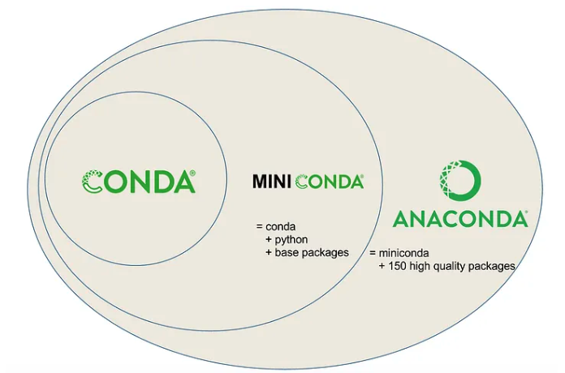

# Best Practices for Software Engineering

In this exemplar we focus on best practices for software engineering in the context of scientific research. These practices are essential for ensuring that code is maintainable, reproducible, and collaborative.

The best practices included are key for producing high-quality code that can be easily shared and understood by others. Importantly, they also ensure analysis are reproducible and can be easily adapted for future research.

## Overview of Best Practices Included in this Exemplar

- Version control (git)
- Virtual environments
- Modularity and modularization
- Code documentation
- Code style, linters, and code formatters
- Continuous integration and continuous deployments
- Code testing
- Configuration management with [Pydantic](https://docs.pydantic.dev/latest/)

## Version control (git and Github)

Version control is a system that records changes to files over time so that you can recall specific versions later. It is essential for collaborative work, allowing multiple people to work on the same codebase without conflicts. The most widely used version control system`git`, which is a *software*. `Github` is a *web-based platform* that uses git for version control and collaboration.

This platform allows users to store, share, and collaborate on software projects in folders called `repositories`. GitHub programmers can work together to create and improve programs, sharing their work with others to use and build upon, facilitating open source projects. Open source refers to software whose code is freely available for anyone to use, modify, and distribute. This promotes collaboration and transparency in software development by allowing communities to contribute improvements and innovations collectively.

Git can be installed here [git-scm.com](https://git-scm.com/). In order to use git and Github, you must install git on your computer and create a Github account. You can create a Github account here [github.com](https://github.com/).

## Virtual environments

Virtual environments (e.g. Anaconda, venv) are isolated environments that allow you to manage dependencies for different projects separately. This is crucial for avoiding conflicts between packages and ensuring that your code runs consistently across different systems.

### Anaconda

Anaconda is a popular distribution of Python and R for scientific computing and data science. It includes a package manager called `conda` that simplifies the process of managing packages and environments. `Package Management Systems` are tools used to install and keep track of the software (and critically versions of software) used on a system and can export files specifying these required software packages/versions.

In addition to the package manager, Anaconda also includes a collection of pre-installed packages commonly used in data science, such as NumPy, pandas, and Matplotlib. This makes it easier to get started with data analysis and scientific computing without having to install each package individually. A user can download either `Anaconda` or `Miniconda`, which is a smaller version of Anaconda that includes only the conda package manager and Python.



#### Creating a virtual environment with conda

To create a virtual environment with conda, you can use the following command in your terminal:

```bash
conda create --name myenv python=3.9
```

This command creates a new environment named `myenv` with Python version 3.9.
To activate the environment, use:

```bash
conda activate myenv
```

To deactivate the environment, use:

```bash
conda deactivate
```

### Virtual environments with venv

`venv` is a built-in module in Python that allows you to create lightweight virtual environments. It is a simpler alternative to Anaconda for managing Python environments. It does not require any additional installations beyond Python itself.

#### Creating a virtual environment with venv

To create a virtual environment with `venv`, you can use the following command in your terminal:

```bash
python -m venv myenv
```

This command creates a new environment named `myenv`. To activate the environment, use:

```bash
source myenv/bin/activate  # On macOS/Linux
myenv\Scripts\activate  # On Windows
```

To deactivate the environment, use:

```bash
deactivate
```

### Which should I use?

The choice between Anaconda and `venv` depends on your specific needs:

- **Anaconda** is more suitable for data science and scientific computing, as it comes with many pre-installed packages and a powerful package manager.
- **venv** is a lightweight option for managing Python environments, especially if you prefer to install packages individually or if you are working on smaller projects.

## Modularity and modularization (e.g. functions, classes)

Broadly, modularity refers to the practice of breaking down a complex system into smaller, manageable parts. This improves code organization, readability, and maintainability. In the context of software engineering, modularity is achieved through the use of functions, classes, and modules. In data science, modularity is often applied to analysis pipelines, where different steps of the analysis are separated into distinct components.

### As defined by a research software engineer

`Code modularity` refers to the practice of organizing code into smaller, reusable components such as functions and classes. This makes code easier to read, maintain, and test. Modular code allows for better collaboration among team members, as different parts of the code can be developed and tested independently.

For example, instead of writing a long script that performs multiple tasks, you can break it down into smaller functions that each handle a specific task. This not only makes the code more organized but also allows for easier debugging and testing.

Without modularity (monolithic code)

```python
numbers = input("Enter numbers separated by commas: ")
numbers = [float(x) for x in numbers.split(",")]

average = sum(numbers) / len(numbers)
maximum = max(numbers)

print(f"Average: {average}")
print(f"Maximum: {maximum}")
```

With modularity (modular code)

```python
def get_numbers():
    user_input = input("Enter numbers separated by commas: ")
    return [float(x) for x in user_input.split(",")]

def calculate_average(numbers):
    return sum(numbers) / len(numbers)

def find_maximum(numbers):
    return max(numbers)

def display_results(average, maximum):
    print(f"Average: {average}")
    print(f"Maximum: {maximum}")

def main():
    numbers = get_numbers()
    avg = calculate_average(numbers)
    max_val = find_maximum(numbers)
    display_results(avg, max_val)

if __name__ == "__main__":
    main()
```

*Bonus:* when using VSCode, you can use the `Refactor` feature to automatically extract code into functions or classes, making it easier to modularize your code. More information on this feature can be found in the [VSCode documentation](https://code.visualstudio.com/docs/editing/refactoring).

### As defined by a data scientist

`Pipeline modularity` refers to separating your analysis pipeline into smaller logical components.

For example, you might have separate functions for data cleaning, feature engineering, model training, and evaluation. Each of these functions can be developed and tested independently, making it easier to manage the overall analysis process. This approach also allows for better collaboration among team members, as different parts of the analysis can be worked on simultaneously.

This can be done by separating an analysis into distinct step. For example, when analyzing single-cell RNA sequencing data, you might have separate steps for loading data, cleaning data, clustering cells, annotating clusters, identifying differentially expressed genes (DEGs), and performing pathway analysis. Each step can be encapsulated in its own function or script, making the analysis pipeline modular and easier to maintain.

```bash
analysis_pipeline/
├── load_data
├── data_cleaning
├── clustering
├── annotation
├── DEG
└── pathway_analysis
```

The example below demonstrates how to modularize a machine learning analysis pipeline using Python. Each step of the analysis is encapsulated in a function, making the code more organized and easier to maintain.

```bash
analysis_pipeline/
├── load_data
├── data_cleaning
├── feature_engineering
├── model_training
├── evaluation
└── evaluation
```

This can be achieved by using functions, classes, or even separate scripts for each step of the analysis as shown below.

```python

from sklearn.datasets import load_iris
from sklearn.model_selection import train_test_split
from sklearn.preprocessing import StandardScaler
from sklearn.ensemble import RandomForestClassifier
from sklearn.metrics import accuracy_score
import pandas as pd

def load_data():
    iris = load_iris(as_frame=True)
    df = iris.frame
    return df, iris.target_names

def clean_data(df):
    # In real cases, handle missing or incorrect values here
    return df.dropna()

def engineer_features(df):
    X = df.drop(columns=["target"])
    y = df["target"]

    scaler = StandardScaler()
    X_scaled = scaler.fit_transform(X)
    return X_scaled, y

def train_model(X_train, y_train):
    model = RandomForestClassifier(random_state=42)
    model.fit(X_train, y_train)
    return model

def evaluate_model(model, X_test, y_test):
    y_pred = model.predict(X_test)
    acc = accuracy_score(y_test, y_pred)
    print(f"Accuracy: {acc:.2f}")

def main():
    df, target_names = load_data()
    df["target"] = df["target"].astype(int)  # Ensure target is numeric
    df = clean_data(df)
    X, y = engineer_features(df)
    X_train, X_test, y_train, y_test = train_test_split(X, y, test_size=0.2, random_state=42)

    model = train_model(X_train, y_train)
    evaluate_model(model, X_test, y_test)

if __name__ == "__main__":
    main()
```

## Code documentation (e.g. docstrings, comments)

Code documentation is the practice of writing comments and explanations within your code to help others (and yourself) understand its purpose and functionality. This is crucial for maintaining code quality, especially in collaborative projects where multiple people may work on the same codebase.

`Docstrings` tell users what a function or class does, its parameters, and its return values. They are typically written in a specific format (e.g., Google style, NumPy style) and can be automatically extracted to generate documentation.

```python

def add(a, b):
    """
    Adds two numbers.

    Args:
        a (int or float): The first number.
        b (int or float): The second number.

    Returns:
        int or float: The sum of the two numbers.
    """
    return a + b
```

`Type hinting` annotations are used to specify the expected data types of function parameters and return values. This helps with code readability and can also be used by static type checkers to catch potential errors.

```python
def add(a: int, b: int) -> int:
    return a + b
```

`Comments` are used to explain specific lines or blocks of code, providing context or clarifying complex logic. They should be concise and relevant, avoiding unnecessary explanations of obvious code.

```python
def add(a: int, b: int) -> int:
    return a + b # add two integers and return the result
```

The following example demonstrates how to use docstrings, type hinting, and comments effectively in a Python function:

```python
def add(a: int, b: int) -> int:
    """
    Adds two integers.

    Args:
        a (int): The first number.
        b (int): The second number.

    Returns:
        int: The sum of the two numbers.
    """
    return a + b # add two integers and return the result
```

## Code style, linters, and code formatters

PEP 8 is the style guide for Python code, providing conventions for writing clean and readable code. Following a consistent style improves code readability and maintainability, making it easier for others to understand and contribute to your code.

The full python style guide can be found here: [PEP 8](https://peps.python.org/pep-0008/).

We've highlighted some of the key points below:

- **Indentation**: Use 4 spaces per indentation level. Avoid using tabs.
- **Line Length**: Limit all lines to a maximum of 79 characters. For docstrings and comments, the line length should be limited to 72 characters.
- **Blank Lines**: Use blank lines to separate functions and classes, and to separate sections within functions. Use two blank lines before top-level function and class definitions, and one blank line between methods in a class.
- **Imports**: Imports should be on separate lines and grouped in the following order: standard library imports, related third-party imports, local application/library-specific imports. Each group should be separated by a blank line.
- **Naming Conventions**: Use descriptive names for variables, functions, and classes. Use lowercase words separated by underscores for function and variable names (e.g., `my_function`), and use CamelCase for class names (e.g., `MyClass`). Constants should be written in all uppercase letters with underscores (e.g., `MY_CONSTANT`).
- **Whitespace**: Avoid extraneous whitespace in expressions and statements. For example, do not use spaces around the `=` sign when assigning a value to a variable, but do use spaces around operators (e.g., `x = 1 + 2` is correct, but `x=1 + 2` is not).

You do not need to memorize all of these rules, but it is important to be aware of them and to use a linter to check your code for style violations. A `linter` is a tool that automatically checks your code for style and syntax errors. For Python, you can use `flake8` or `pylint` as linters. We recommend using `ruff`, which is a fast and highly configurable linter that can be used to enforce PEP 8 style guidelines and other coding standards.

To install linters and use them in VSCode, you can follow these steps:

1. Install the linter using pip:
        ```bash
        pip install ruff
        ```
2. Open VSCode and go **to the settings (File > Preferences > Settings).
3. Search for "Python Linting" and enable it.
4. Set the linter you want to use (e.g., ruff) in the settings. You can also choose the version of Python you want to use for linting.**
5. Save your settings and restart VSCode.

## Continuous integration

Continuous integration (CI) is a software development practice where code changes are automatically tested and integrated into the main codebase.  It is a workflow that allows developers to automatically run tests and checks on their code before it is merged into the main branch. This helps catch errors early, ensures that the codebase remains stable, ensure that the code is of high quality and meets the project's standards.

CI is usually done using a CI tool, such as GitHub Actions, that can automatically run tests, check code style, and perform other checks on your code whenever you push changes to the repository. These tests can include unit tests, integration tests, and other types of tests that ensure your code works as expected. Users will specify the tests they want to run in a configuration file, which is then used by the CI tool to run the workflow automatically.

### Github Actions

GitHub Actions is a platform that allows you to automate developer workflows directly within your GitHub repository. The workflows are made up of individual tasks called actions, which can be combined to create a complete workflow. You can use workflow templates to quickly set up common workflows, such as running tests, building code, or deploying applications. You can define workflows in YAML files that specify the steps to be executed when certain events occur.

In this Exemplar, we have a `.github/workflows/ci.yml` file that defines a CI workflow. This workflow is triggered on every push and pull request to the main branch. It runs tests using `pytest`, checks code style with `ruff`, and builds the documentation using `mkdocs`. We also have additional workflows for testing markdown files links are working in the `.github/workflows/link_checker.yml`.

Read more about GitHub Actions in the [GitHub Actions documentation](https://docs.github.com/en/actions).

Automatic docs documentation generation is also a common practice in software development. It allows you to automatically generate documentation from your code, making it easier to keep the documentation up to date and ensuring that it reflects the current state of the codebase. This can be done using tools like Sphinx or MkDocs, which can generate HTML or PDF documentation from your code comments and docstrings.

### Exemplar CI workflows

In this Exemplar, we used several CI tools. Below we have highlighted a few you might find useful:

- Publish MkDocs to create a static website for documentation (`.github/workflows/doc.yml`)
- Link Checker to check that all links in the documentation are working (`.github/workflows/link_checker.yml`)
- Pre-commit to automatically run code quality checks and enforce coding standards before code is committed to the repository

In order to use the tools, you will need to create a .yml file in .github/workflow folder. Copy the contents from the pre-existing .yml file below and paste it into your new .yml file. You can then edit the file to suit your needs.

To see all the CI tools and workflows used and their .yml files, please look in the `.github/workflows/` folder.

#### Pre-commit

In order to use `pre-commit` in your project, you will need to install pre-commit and create a `.pre-commit-config.yaml` file in the root of your repository.

`pre-commit` is a CI tool which automates code quality checks and enforces coding standards. It automatically points out issues in code such as missing semicolons, trailing whitespace, and debug statements.

Pre-commit hooks are scripts that run automatically before a commit is made, allowing you to catch errors and enforce coding standards before code is added to the repository. This helps maintain code quality and consistency across the project. Learn more about pre-commit hooks in the [pre-commit documentation](https://pre-commit.com/).

To use `pre-commit` in your project follow the following steps:

1. Install `pre-commit` using pip:

    ```bash
    pip install pre-commit
    ```

2. Create a `.pre-commit-config.yaml` file in the root of your repository. You can generate a very basic configuration using

    ```bash
    pre-commit sample-config
    ```

3. Add the hooks you want to use in the `.pre-commit-config.yaml` file.
Here is an example configuration that includes `pre-commit` for linting and `ruff` for code formatting:

    ```yaml
        repos:
        - repo: https://github.com/pre-commit/pre-commit-hooks
            rev: v5.0.0
            hooks:
            - id: check-merge-conflict
            - id: debug-statements
            - id: trailing-whitespace
            - id: end-of-file-fixer
        - repo: https://github.com/macisamuele/language-formatters-pre-commit-hooks
            rev: v2.15.0
            hooks:
            - id: pretty-format-yaml
                args: [--autofix, --indent, '2', --offset, '2']
        - repo: https://github.com/astral-sh/ruff-pre-commit
            rev: v0.12.3
            hooks:
            - id: ruff
                args: [--fix, --exit-non-zero-on-fix]
            - id: ruff-format
                args: [--fix, --exit-non-zero-on-fix]
    ```

4. Install the pre-commit git hooks by running:

    ```bash
    pre-commit install
    ```

## Configuration management with [Pydantic](https://docs.pydantic.dev/latest/)

Configuration management is the practice of managing and maintaining the configuration of software systems. This includes managing settings, parameters, and other configuration data that can affect the behavior of the software. Pydantic is a Python library that provides data validation and settings management using Python type annotations.

Pydantic allows you to define data models with type annotations, which can be used to validate and parse configuration data. This is particularly useful for managing configuration files, environment variables, and other settings in a structured way.

Pydantic is explained in more detail in the [Configuration Guide](docs/configuration.md) page.

## Code testing

Code testing is the practice of writing tests to verify that your code behaves as expected. This is crucial for ensuring code quality and catching bugs early in the development process. There are several types of tests, including unit tests, integration tests, and end-to-end tests.

Unit tests are used to test individual functions or methods in isolation, while integration tests check how different components of the code work together. End-to-end tests simulate real user interactions with the software to ensure that the entire system works as expected.

To write tests in Python, you can use the built-in `unittest` module or third-party libraries like `pytest`. These libraries provide tools for writing and running tests, as well as assertions to check the expected behavior of your code.

To write a simple unit test using `unittest` or `pytest`, you can follow this example:

1. Write a function to be tested using Python and pytest

    ```python
    def add(a: int, b: int) -> int:
        """Adds two integers."""
        return a + b

    def test_add_positive_numbers():
        assert add(2, 3) == 5

    def test_add_negative_numbers():
        assert add(-1, -4) == -5

    def test_add_mixed_sign_numbers():
        assert add(-2, 5) == 3

    def test_add_zero():
        assert add(0, 5) == 5
        assert add(5, 0) == 5
        assert add(0, 0) == 0
    ```

2. Save this to a file labeled test_function_name.py (e.g test_add.py)
3. Run the test from the command line

    ```bash
    pytest test_add.py
    ```

4. If the tests pass, you will see output indicating that all tests were successful. If any test fails, pytest will provide detailed information about the failure.

## More Information on Best Practices

If you would like to learn more about best practices for software engineering, we recommend the following resources:

- [The Turning Way](https://book.the-turing-way.org): A comprehensive guide to reproducible research practices, including software engineering best practices.
- [Good Enough Practices in Scientific Computing](https://carpentries-lab.github.io/good-enough-practices/index.html)
- [Software Carpentry](https://software-carpentry.org/): A great resource for learning about best practices in software development, particularly for researchers.
- [The Carpentries](https://carpentries.org/): Offers workshops and resources on software development best practices, including version control, testing, and documentation.
